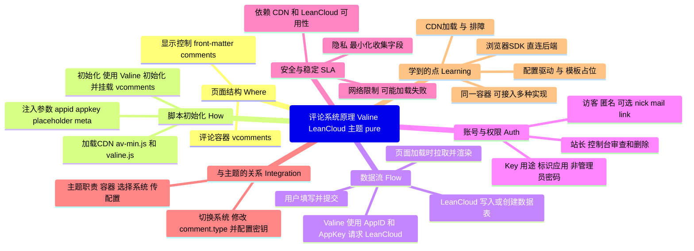

## 目录
- [x] [linkformat](#linkformat)
- [x] [Google analysis](#配置Google-analysis)
- [] [Comment System](#comment-system)
---
## linkformat
### 把文章链接改成 postname，无日期（已实操，已注释）

我希望把文章地址从带日期的结构改为仅使用文章名。例如当前这篇示例是带日期的：`https://www.jiangxu.net/2025/08/14/study-materials/`（参考链接见文末）。目标是变为：`https://www.jiangxu.net/study-materials/`。

- 关键词：Hexo `permalink`、`:title`、`slug`、`front-matter` 覆盖、`pretty_urls`

> 更改之前


> 更改之后


### 具体的技术问题

1) 这是什么，为什么要改？
- 在 Hexo 里，`permalink` 决定每篇文章最终生成的访问路径。默认常见的是 `:year/:month/:day/:title/`，更偏向博客时间线；改成 `:title/` 可以获得更短、更“永久”的链接，便于记忆与分享。

2) 名词解释
- [x] permalink：固定链接模板，支持占位符（如 `:title`）。
- [x] title vs slug：`title` 是文章标题，`slug` 是 URL 里使用的“短名称”。中文标题会直接出现在 URL 中（或被转义）。为保证简洁稳定，建议在 front-matter 里显式写 `slug`（英文/拼音）。
- [x] front-matter 覆盖：单篇文章的 `permalink` 字段可以覆盖全局策略。
> 全站用一种规则，但某一篇你想要特别的 URL，就在这篇的 front-matter 里写 permalink，它会直接生效
- [x] pretty_urls：去除 `index.html`/`.html` 的外观选项，不改变目录式链接本质。
> 文件式链接显式带 .html 后缀；目录式链接不带后缀、更简洁
3) 工作原理（Hexo 渲染 → 最终 URL）
- Hexo 根据 `_config.yml` 的 `permalink` 模板，为每篇文章计算目标路径；例如 `:title/` 会在 `public/study-materials/index.html` 生成文件，访问时即 `https://域名/study-materials/`。
- 主题里常用 `post.permalink`/`page.permalink` 读取该最终地址，变化后会自动跟随，无需改主题模板。

4) 如何修改（不改主题，只动 Hexo 主配置）

- 打开站点根目录的 `_config.yml`，把 `permalink` 改为仅使用文章名：

```yaml
# URL
url: https://jiangxu.net/
permalink: :title/
pretty_urls:
  trailing_index: false   # 去掉末尾的 index.html（目录式链接更干净）
  trailing_html: true     # 保持目录式，不使用 .html 直出
```


- 对中文标题或想自定义 URL 的文章，在 front-matter 里增加 `slug`：

```md
---
title: 学习资料
slug: study-materials
date: 2025-08-14 00:00:00
---
```


- slug 与 URL 情况对照表

| 情况 | 源文件名 | front-matter | 全局 permalink | 最终 URL |
| --- | --- | --- | --- | --- |
| 标题=文件名，不写 slug | 学习资料.md | title: 学习资料 | :title/ | /学习资料/ |
| 标题≠文件名，不写 slug | hello-world.md | title: 学习资料 | :title/ | /hello-world/ |
| 写了 slug → 强制用 slug | hello-world.md | title: 学习资料, slug: study-materials | :title/ | /study-materials/ |
| 文件名含空格/符号，不写 slug | My Post!!!.md | title: 随笔 | :title/ | /my-post/ |
| 只改标题，不改文件名，不写 slug | hello-world.md | title: 学习资料（更新版） | :title/ | /hello-world/ |
| 改了文件名，不写 slug | greeting.md（改名后） | title: 学习资料 | :title/ | /greeting/ |

- 只想个别文章自定义完整路径（覆盖全局模板），可在该文 front-matter 指定 `permalink`：

```md
---
title: 特殊文章
permalink: my-special-post/
---
```
5) 常见问题与排查
- 重名冲突：`permalink: :title/` 下，两个同名标题会竞争同一路径。给其中一个加 `slug` 解决。
- 中文/符号 URL：建议写 `slug`，避免 URL 编码或不稳定字符。
- 分类在路径里？若你想保留分类，可用 `:categories/:title/` 模板。
- 本地没生效：确认已 `hexo clean`，并非浏览器缓存；命令行无错误后再测试。


## 配置Google analysis
### 我的说明
我给博客加了一个“计数器”。它能记录：有人打开了哪一页、做了哪些关键动作。
- 整页跳转时，它会自动记一次“看了一页”。
- 我还加了两个小统计：点出去的链接、复制代码。这样更容易看出哪些内容有用。
- 我能在后台的“实时”页面马上看到有没有上报成功。

我用到的：
- GA4：谷歌的统计系统
- Measurement ID：类似你家门牌号，告诉数据送到哪
- gtag.js：放在页面上的统计代码
- dataLayer：给统计代码传消息的“队列”
- page_view：记录“看了一页”
- 事件（event）：记录“做了一个动作”，比如点链接、复制
- Realtime/DebugView：后台用来看数据有没有进来

### 具体的技术问题

1) 这是什么，为什么要用它？
- GA4 是网站“访问统计与行为分析”的系统。它记录“有人来过哪一页、做了什么动作”。有了它，能回答“哪篇文章更受欢迎、用户从哪里来、点了哪些按钮”。

2) 名词解释（最常见的就这些）
- [x] GA4 Property：你的数据容器，所有事件最终汇总到这里。
- [x] Measurement ID：形如 `G-XXXXXXXXXX`，告诉 GA4 “发到哪个容器”。
- [x] gtag.js：Google 提供的统计代码（SDK：给开发者用的一包工具），负责把信息打包并发送。
- [x] dataLayer：浏览器里的“事件队列”，`gtag()` 把配置与事件都 push 进去。
- [x] page_view：页面浏览事件；SPA/PJAX 不会自动刷新页面，需要手动上报。
- [x] Event：通用事件（名字 + 参数），比如 `click_outbound`、`copy_code`。
- [x] Client ID（_ga）：匿名访客 ID（存在一方 Cookie），用于区分不同用户。
- [x] DebugView/Realtime：调试与实时数据查看界面。
- [x] Cookie：浏览器为网站保存的一小段文字，网站下次访问时能认出“还是你”。
- [x] Client ID：存放在 Cookie 里的匿名编号，用来区分不同访客（不含个人信息）。
- [x] CSP：内容安全策略，像“白名单”，只允许从指定域加载脚本/发请求；未放行会被浏览器拦截。
- [x] 第一次访问：gtag.js 没找到编号 → 生成一个新的 Client ID → 写进 Cookie。
- [x] 以后访问：浏览器会自动把 Cookie 带上；gtag.js 读取 Cookie 里的 Client ID → 识别是同一位访客。

3) 数据流转图（GA4 上报链路）
> 自制，边画图边理解约2h
> 


4) 如何接入（整页跳转站点）
```html
<script async src="https://www.googletagmanager.com/gtag/js?id=G-XXXXXXXXXX"></script>
<script>
  window.dataLayer = window.dataLayer || [];
  function gtag(){ dataLayer.push(arguments); }
  gtag('js', new Date());
  gtag('config', 'G-XXXXXXXXXX', { send_page_view: true });
</script>
```

### 举例 

访客Y第一次打开（访客浏览器）

- 访客浏览器：请求你的博客页面；页面里包含 `gtag.js`（从 Google 官网域名加载）。
- gtag.js：在访客浏览器里执行，初始化 `dataLayer` 事件队列。
- Cookie / Client ID：如果没有发现 `_ga`，就生成新的 Client ID，并把它写进 Cookie。
- Measurement ID：调用 `gtag('config', 'G-XXXXXXXXXX', ...)`，把数据归到你自己的 GA4 Property。
- Consent Mode：按默认规则限制可发送内容（更保守的上报）。
- CSP：需放行 `googletagmanager.com` 与 `google-analytics.com`，否则浏览器会拦截统计请求。
- page_view：
  - 整页跳转主题：自动发送一次 `page_view`。
- 事件：用户操作（如 `click_outbound`、`copy_code`）由 `gtag.js` 打包为“事件”。
- 发送目的地：请求直接从“访客浏览器”发到“Google 官网” `google-analytics.com/g/collect`，不会经过你的服务器。
- 入库与查看：数据进入你的 GA4 数据仓库（Property），你能在 Realtime/DebugView 里立刻看到。

访客Y第二次打开（不同点，其它相同）

- 访客浏览器：会自动带上上次保存的 Cookie。
- gtag.js：读取到已有的 Client ID（不再新建），继续用同一个编号上报。
- 其余步骤与第一次相同；由于 Client ID 相同，GA4 会把两次访问识别为同一位访客（除非清除了 Cookie、换了设备或浏览器）。


---
## comment sysytem
### 给老师的一段话（概述）

老师您好，我是正在转专业的学生。我在博客里开通“评论”功能，是想把自学过程中的疑问与收获沉淀下来，也方便向老师与同学请教、接受批改与反馈。配置评论让我动手理解了网站前端的基本结构：主题模板如何预留评论位置、配置文件如何驱动功能启停、以及如何把外部服务（例如 LeanCloud）安全地“接到”我的页面里。我会注意不收集不必要的个人信息，只用它来进行学术讨论与学习交流。

### 配置教程与可学到的技术点（基于 theme: `pure` 与评论 `valine`）

下面是完全零基础也能照做的步骤，全部不需要写代码，只修改配置即可。

1) 选择评论系统（我们用 Valine）
- 主题 `pure` 已内置 Disqus/Gitalk/Valine 等多种评论系统。你当前主题配置里已经选了 `valine`，所以我们沿用它。
- 你可以在主题配置文件里看到开关：

```166:154:/Users/jiangxu/Documents/code/myblog/themes/pure/_config.yml
# Comment
comment:
  type: valine  # 启用哪种评论系统
  valine:
    appid:  # your leancloud application appid
    appkey:  # your leancloud application appkey
    placeholder:  hello i'm jiangxu.
```

2) 注册 LeanCloud，拿到 `AppID` 和 `AppKey`
- 打开浏览器，注册并登录 LeanCloud（国际版更稳定，建议使用国际站）。
- 新建一个应用（随意命名，例如 `myblog-comments`）。
- 在应用设置里找到并复制 `AppID` 与 `AppKey`。
- Valine 首次运行时会自动创建数据表，无需手工建表。

3) 把密钥填进主题配置
- 打开文件：`themes/pure/_config.yml`。
- 在 `comment.valine.appid` 与 `comment.valine.appkey` 填入你从 LeanCloud 拿到的值；占位符可按需调整，比如 `placeholder: 欢迎留言交流学习~`。
- 保存后即可。

4) 评论容器与脚本已经在主题里就绪（无需改模板）
- 文章页底部已渲染评论容器：

```17:20:/Users/jiangxu/Documents/code/myblog/themes/pure/layout/_partial/post/comment.ejs
  <% } else if (theme.comment.type === 'valine') { %>
    <div id="vcomments"></div>
  <% } %>
```

- 对应的初始化脚本也已内置，会把你在配置里填的 `appid/appkey/placeholder` 等传给 Valine：

```2:7:/Users/jiangxu/Documents/code/myblog/themes/pure/layout/_script/_comment/valine.ejs
  <script src="//cdn1.lncld.net/static/js/3.0.4/av-min.js"></script>
  <script src="//cdn.jsdelivr.net/npm/valine"></script>
  <script type="text/javascript">
  var GUEST = ['nick', 'mail', 'link'];
  var meta = '<%= theme.comment.valine.meta %>';
```

5) 确保文章开启评论
- Hexo 对文章默认是开启评论的；若你在某篇 front‑matter 里显式写了 `comments: false`，请删掉或改为：

```md
---
title: 某篇文章
comments: true
---
```

6) 本地预览与部署
- 本地预览：
  - 运行：`hexo clean && hexo g && hexo s`
  - 打开浏览器访问本地地址，进入任意文章页，滚动到页面底部，应该能看到评论框。
- 部署上线：按你平时的发布方式（如 `hexo g -d` 或 Vercel 自动部署）。

7) 常见问题（遇到看这里）
- 页面没显示评论框：检查主题配置里的 `comment.type` 是否为 `valine`，以及该文章 `comments` 是否为 `true`。
- 初始化报错或加载很慢：有时 `cdn1.lncld.net` 或 `cdn.jsdelivr.net` 在部分网络环境下不稳定，稍后再试或切换网络。如果长期不稳定，可考虑迁移到 Gitalk（需 GitHub OAuth）等方案。
- 留言不入库：确认 LeanCloud 应用使用的“国际版/国内版”与你的脚本域相匹配；核对 `AppID/AppKey` 是否粘贴完整。

8) 我能学到的技术点（零基础友好）
- 配置驱动的前端能力：不改代码，通过改 YAML 配置实现功能启停与参数化。
- 模板与占位容器：主题在文章底部放了一个 `#vcomments` 容器，脚本会把评论 UI 挂载进去。
- 第三方 SDK 初始化：Valine 作为“无后端评论系统”，用浏览器直接连到 LeanCloud 保存数据。
- 资源加载与网络调试：评论依赖的 JS 从 CDN 加载，学会在浏览器开发者工具里看 Network 面板排查问题。
- 安全与隐私常识：仅填必要的 `AppID/AppKey`，不收集敏感信息，按需关闭邮件通知。

做到这里，你已经完成了一个完整的小型“前端集成”任务：读配置 → 连接外部服务 → 本地验证 → 上线发布。后续如果你想尝试别的评论系统（例如 Gitalk），只要把 `comment.type` 改为 `gitalk` 并按照它的字段填写 `ClientID/ClientSecret` 等即可。

### 评论原理：思维导图

