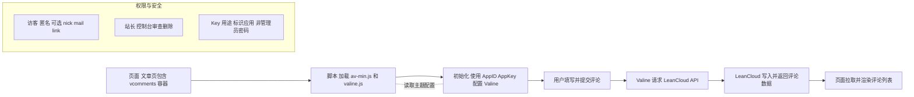

## 目录
- [x] [linkformat](#linkformat)
- [x] [Google analysis](#配置Google-analysis)
- [x] [Comment System](#comment-system)
- [x] [Auto Update Time](#文章时间自动更新)
---
## linkformat
### 把文章链接改成 postname，无日期（已实操，已注释）

我希望把文章地址从带日期的结构改为仅使用文章名。例如当前这篇示例是带日期的：`https://www.jiangxu.net/2025/08/14/study-materials/`（参考链接见文末）。目标是变为：`https://www.jiangxu.net/study-materials/`。

- 关键词：Hexo `permalink`、`:title`、`slug`、`front-matter` 覆盖、`pretty_urls`

> 更改之前


> 更改之后


### 具体的技术问题

1) 这是什么，为什么要改？
- 在 Hexo 里，`permalink` 决定每篇文章最终生成的访问路径。默认常见的是 `:year/:month/:day/:title/`，更偏向博客时间线；改成 `:title/` 可以获得更短、更“永久”的链接，便于记忆与分享。

2) 名词解释
- [x] permalink：固定链接模板，支持占位符（如 `:title`）。
- [x] title vs slug：`title` 是文章标题，`slug` 是 URL 里使用的“短名称”。中文标题会直接出现在 URL 中（或被转义）。为保证简洁稳定，建议在 front-matter 里显式写 `slug`（英文/拼音）。
- [x] front-matter 覆盖：单篇文章的 `permalink` 字段可以覆盖全局策略。
> 全站用一种规则，但某一篇你想要特别的 URL，就在这篇的 front-matter 里写 permalink，它会直接生效
- [x] pretty_urls：去除 `index.html`/`.html` 的外观选项，不改变目录式链接本质。
> 文件式链接显式带 .html 后缀；目录式链接不带后缀、更简洁
3) 工作原理（Hexo 渲染 → 最终 URL）
- Hexo 根据 `_config.yml` 的 `permalink` 模板，为每篇文章计算目标路径；例如 `:title/` 会在 `public/study-materials/index.html` 生成文件，访问时即 `https://域名/study-materials/`。
- 主题里常用 `post.permalink`/`page.permalink` 读取该最终地址，变化后会自动跟随，无需改主题模板。

4) 如何修改（不改主题，只动 Hexo 主配置）

- 打开站点根目录的 `_config.yml`，把 `permalink` 改为仅使用文章名：

```yaml
# URL
url: https://jiangxu.net/
permalink: :title/
pretty_urls:
  trailing_index: false   # 去掉末尾的 index.html（目录式链接更干净）
  trailing_html: true     # 保持目录式，不使用 .html 直出
```


- 对中文标题或想自定义 URL 的文章，在 front-matter 里增加 `slug`：

```md
---
title: 学习资料
slug: study-materials
date: 2025-08-14 00:00:00

---

```


- slug 与 URL 情况对照表

| 情况 | 源文件名 | front-matter | 全局 permalink | 最终 URL |
| --- | --- | --- | --- | --- |
| 标题=文件名，不写 slug | 学习资料.md | title: 学习资料 | :title/ | /学习资料/ |
| 标题≠文件名，不写 slug | hello-world.md | title: 学习资料 | :title/ | /hello-world/ |
| 写了 slug → 强制用 slug | hello-world.md | title: 学习资料, slug: study-materials | :title/ | /study-materials/ |
| 文件名含空格/符号，不写 slug | My Post!!!.md | title: 随笔 | :title/ | /my-post/ |
| 只改标题，不改文件名，不写 slug | hello-world.md | title: 学习资料（更新版） | :title/ | /hello-world/ |
| 改了文件名，不写 slug | greeting.md（改名后） | title: 学习资料 | :title/ | /greeting/ |

- 只想个别文章自定义完整路径（覆盖全局模板），可在该文 front-matter 指定 `permalink`：

```md
---
title: 特殊文章
permalink: my-special-post/

---
```
5) 常见问题与排查
- 重名冲突：`permalink: :title/` 下，两个同名标题会竞争同一路径。给其中一个加 `slug` 解决。
- 中文/符号 URL：建议写 `slug`，避免 URL 编码或不稳定字符。
- 分类在路径里？若你想保留分类，可用 `:categories/:title/` 模板。
- 本地没生效：确认已 `hexo clean`，并非浏览器缓存；命令行无错误后再测试。


## 配置Google analysis
### 我的说明
我给博客加了一个“计数器”。它能记录：有人打开了哪一页、做了哪些关键动作。
- 整页跳转时，它会自动记一次“看了一页”。
- 我还加了两个小统计：点出去的链接、复制代码。这样更容易看出哪些内容有用。
- 我能在后台的“实时”页面马上看到有没有上报成功。

我用到的：
- GA4：谷歌的统计系统
- Measurement ID：类似你家门牌号，告诉数据送到哪
- gtag.js：放在页面上的统计代码
- dataLayer：给统计代码传消息的“队列”
- page_view：记录“看了一页”
- 事件（event）：记录“做了一个动作”，比如点链接、复制
- Realtime/DebugView：后台用来看数据有没有进来

### 具体的技术问题

1) 这是什么，为什么要用它？
- GA4 是网站“访问统计与行为分析”的系统。它记录“有人来过哪一页、做了什么动作”。有了它，能回答“哪篇文章更受欢迎、用户从哪里来、点了哪些按钮”。

2) 名词解释（最常见的就这些）
- [x] GA4 Property：你的数据容器，所有事件最终汇总到这里。
- [x] Measurement ID：形如 `G-XXXXXXXXXX`，告诉 GA4 “发到哪个容器”。
- [x] gtag.js：Google 提供的统计代码（SDK：给开发者用的一包工具），负责把信息打包并发送。
- [x] dataLayer：浏览器里的“事件队列”，`gtag()` 把配置与事件都 push 进去。
- [x] page_view：页面浏览事件；SPA/PJAX 不会自动刷新页面，需要手动上报。
- [x] Event：通用事件（名字 + 参数），比如 `click_outbound`、`copy_code`。
- [x] Client ID（_ga）：匿名访客 ID（存在一方 Cookie），用于区分不同用户。
- [x] DebugView/Realtime：调试与实时数据查看界面。
- [x] Cookie：浏览器为网站保存的一小段文字，网站下次访问时能认出“还是你”。
- [x] Client ID：存放在 Cookie 里的匿名编号，用来区分不同访客（不含个人信息）。
- [x] CSP：内容安全策略，像“白名单”，只允许从指定域加载脚本/发请求；未放行会被浏览器拦截。
- [x] 第一次访问：gtag.js 没找到编号 → 生成一个新的 Client ID → 写进 Cookie。
- [x] 以后访问：浏览器会自动把 Cookie 带上；gtag.js 读取 Cookie 里的 Client ID → 识别是同一位访客。

3) 数据流转图（GA4 上报链路）
> 自制，边画图边理解约2h
> 


4) 如何接入（整页跳转站点）
```html
<script async src="https://www.googletagmanager.com/gtag/js?id=G-XXXXXXXXXX"></script>
<script>
  window.dataLayer = window.dataLayer || [];
  function gtag(){ dataLayer.push(arguments); }
  gtag('js', new Date());
  gtag('config', 'G-XXXXXXXXXX', { send_page_view: true });
</script>
```

### 举例 

访客Y第一次打开（访客浏览器）

- 访客浏览器：请求你的博客页面；页面里包含 `gtag.js`（从 Google 官网域名加载）。
- gtag.js：在访客浏览器里执行，初始化 `dataLayer` 事件队列。
- Cookie / Client ID：如果没有发现 `_ga`，就生成新的 Client ID，并把它写进 Cookie。
- Measurement ID：调用 `gtag('config', 'G-XXXXXXXXXX', ...)`，把数据归到你自己的 GA4 Property。
- Consent Mode：按默认规则限制可发送内容（更保守的上报）。
- CSP：需放行 `googletagmanager.com` 与 `google-analytics.com`，否则浏览器会拦截统计请求。
- page_view：
  - 整页跳转主题：自动发送一次 `page_view`。
- 事件：用户操作（如 `click_outbound`、`copy_code`）由 `gtag.js` 打包为“事件”。
- 发送目的地：请求直接从“访客浏览器”发到“Google 官网” `google-analytics.com/g/collect`，不会经过你的服务器。
- 入库与查看：数据进入你的 GA4 数据仓库（Property），你能在 Realtime/DebugView 里立刻看到。

访客Y第二次打开（不同点，其它相同）

- 访客浏览器：会自动带上上次保存的 Cookie。
- gtag.js：读取到已有的 Client ID（不再新建），继续用同一个编号上报。
- 其余步骤与第一次相同；由于 Client ID 相同，GA4 会把两次访问识别为同一位访客（除非清除了 Cookie、换了设备或浏览器）。


---
## Comment System
### 我的说明

老师您好，我是正在转专业的学生。我在博客里开通“评论”功能，是想把自学过程中的疑问与收获沉淀下来，也方便向老师与同学请教、接受批改与反馈。配置评论让我动手理解了网站前端的基本结构：主题模板如何预留评论位置、配置文件如何驱动功能启停、以及如何把外部服务（例如 LeanCloud）安全地“接到”我的页面里。我会注意不收集不必要的个人信息，只用它来进行学术讨论与学习交流。

### 具体的技术问题

下面是完全零基础也能照做的步骤，全部不需要写代码，只修改配置即可。

1) 选择评论系统（我们用 Valine）
- 主题 `pure` 已内置 Disqus/Gitalk/Valine 等多种评论系统。你当前主题配置里已经选了 `valine`，所以我们沿用它。
- 你可以在主题配置文件里看到开关：

```166:154:/Users/jiangxu/Documents/code/myblog/themes/pure/_config.yml
# Comment
comment:
  type: valine  # 启用哪种评论系统
  valine:
    appid:  # your leancloud application appid
    appkey:  # your leancloud application appkey
    placeholder:  hello i'm jiangxu.
```

2) 注册 LeanCloud，拿到 `AppID` 和 `AppKey`
- 打开浏览器，注册并登录 LeanCloud（国际版更稳定，建议使用国际站）。
- 新建一个应用（随意命名，例如 `myblog-comments`）。
- 在应用设置里找到并复制 `AppID` 与 `AppKey`。
- Valine 首次运行时会自动创建数据表，无需手工建表。

3) 把密钥填进主题配置
- 打开文件：`themes/pure/_config.yml`。
- 在 `comment.valine.appid` 与 `comment.valine.appkey` 填入你从 LeanCloud 拿到的值；占位符可按需调整，比如 `placeholder: 欢迎留言交流学习~`。
- 保存后即可。

3.1) （重要）按应用区域填写 serverURLs
- 若出现“点击发表后按钮变灰卡住”的情况，多为区域/白名单问题。请在同一文件加入 `serverURLs`：

```142:152:/Users/jiangxu/Documents/code/myblog/themes/pure/_config.yml
  valine:
    appid:  hZ1VFfxf5vPE29u8ce5kpDop-MdYXbMMI
    appkey:  8G557D53kpZDCPZvuPdmUgXB
    serverURLs: https://hz1vffxf.api.lncldglobal.com
    placeholder:  hello i'm jiangxu.
    pageSize: 10
```

4) 评论容器与脚本已经在主题里就绪（无需改模板）
- 文章页底部已渲染评论容器：

```17:20:/Users/jiangxu/Documents/code/myblog/themes/pure/layout/_partial/post/comment.ejs
  <% } else if (theme.comment.type === 'valine') { %>
    <div id="vcomments"></div>
  <% } %>
```

- 对应的初始化脚本也已内置，会把你在配置里填的 `appid/appkey/placeholder` 等传给 Valine：

```2:7:/Users/jiangxu/Documents/code/myblog/themes/pure/layout/_script/_comment/valine.ejs
  <script src="//cdn1.lncld.net/static/js/3.0.4/av-min.js"></script>
  <script src="//cdn.jsdelivr.net/npm/valine"></script>
  <script type="text/javascript">
  var GUEST = ['nick', 'mail', 'link'];
  var meta = '<%= theme.comment.valine.meta %>';
```

- 我已为你补充了区域与路径的关键初始化参数，确保手机与电脑使用同一评论线程：

```8:22:/Users/jiangxu/Documents/code/myblog/themes/pure/layout/_script/_comment/valine.ejs
  // 归一化页面路径，避免 index.html/尾斜杠差异造成“不同线程”
  var pagePath = window.location.pathname.replace(/index\.html$/, '/');
  if (!/\/$/.test(pagePath)) { pagePath += '/'; }
  new Valine({
    el: '#vcomments',
    appId: '<%= theme.comment.valine.appid %>',
    appKey: '<%= theme.comment.valine.appkey %>',
    <% if (theme.comment.valine.serverURLs) { %>
    serverURLs: '<%= theme.comment.valine.serverURLs %>',
    <% } %>
    pageSize: '<%= theme.comment.valine.pageSize %>' || 10,
    visitor: <%= theme.comment.valine.visitor %>,
    path: pagePath
  });
```

5) 确保文章开启评论
- Hexo 对文章默认是开启评论的；若你在某篇 front‑matter 里显式写了 `comments: false`，请删掉或改为：

```md
---
title: 某篇文章
comments: true
---
```

6) 本地预览与部署
- 本地预览：
  - 运行：`hexo clean && hexo g && hexo s`
  - 打开浏览器访问本地地址，进入任意文章页，滚动到页面底部，应该能看到评论框。
- 部署上线：按你平时的发布方式（如 `hexo g -d` 或 Vercel 自动部署）。

6.1) 手机/局域网联调（可选）
- 启动可被手机访问的本地服务：`hexo s -i 0.0.0.0`
- 在 mac 终端查 IP：`ipconfig getifaddr en0`（或 `en1`）
- 手机访问：`http://<你的电脑IP>:4000`
- LeanCloud “安全域名/Referer 白名单”需包含：
  - `http://localhost:4000`
  - `http://127.0.0.1:4000`
  - `http://<你的电脑IP>:4000`

7) 常见问题（遇到看这里）
- 页面没显示评论框：检查主题配置里的 `comment.type` 是否为 `valine`，以及该文章 `comments` 是否为 `true`。
- 初始化报错或加载很慢：有时 `cdn1.lncld.net` 或 `cdn.jsdelivr.net` 在部分网络环境下不稳定，稍后再试或切换网络。如果长期不稳定，可考虑迁移到 Gitalk（需 GitHub OAuth）等方案。
- 留言不入库/按钮变灰：
  - 确认 `serverURLs` 为你应用所在区域提供的域名（如 `https://hz1vffxf.api.lncldglobal.com`）。
  - LeanCloud 白名单需包含你的访问来源（本地/局域网 IP/线上域名），否则返回 401/403。
  - 电脑能看到、手机看不到的多因“页面路径不一致”，已通过 `path` 归一化解决。

8) 我能学到的技术点（零基础友好）
- 配置驱动的前端能力：不改代码，通过改 YAML 配置实现功能启停与参数化。
- 模板与占位容器：主题在文章底部放了一个 `#vcomments` 容器，脚本会把评论 UI 挂载进去。
- 第三方 SDK 初始化：Valine 作为“无后端评论系统”，用浏览器直接连到 LeanCloud 保存数据。
- 资源加载与网络调试：评论依赖的 JS 从 CDN 加载，学会在浏览器开发者工具里看 Network 面板排查问题。
- 安全与隐私常识：仅填必要的 `AppID/AppKey`，不收集敏感信息，按需关闭邮件通知。

做到这里，你已经完成了一个完整的小型“前端集成”任务：读配置 → 连接外部服务 → 本地验证 → 上线发布。后续如果你想尝试别的评论系统（例如 Gitalk），只要把 `comment.type` 改为 `gitalk` 并按照它的字段填写 `ClientID/ClientSecret` 等即可。

### 数据流转图（评论链路）



---
## 文章时间自动更新
### 我的说明

我在写博客时遇到一个痛点：每次更新文章内容，front-matter 里的 `date` 字段不会自动变化。读者看不出文章是新写的还是更新过的，我也要手动改日期很麻烦。后来配置了 Hexo 的 `updated` 字段，它会自动使用文件的修改时间，现在我只要编辑保存，更新时间就自动记录了，再也不用手动改了。

我用到的：
- **date**：文章创建时间（固定不变）
- **updated**：文章更新时间（自动使用文件修改时间）
- **updated_option**：Hexo 配置项，控制 updated 的来源
- **mtime**：文件修改时间（操作系统记录的）
- **front-matter**：文章开头的元数据区域
- **scaffold**：文章模板，控制新建文章的默认内容

### 具体的技术问题

1) 这是什么，为什么要用它？
- Hexo 支持两个时间字段：`date`（创建时间）和 `updated`（更新时间）。`date` 是固定的，记录文章首次发布；`updated` 可以自动跟随文件修改时间变化。这样读者能看到"这篇文章最近更新过"，搜索引擎也能识别内容的新鲜度。

2) 名词解释
- [x] **date**：文章创建/发布时间，写在 front-matter 里，除非手动改否则不变。
- [x] **updated**：文章更新/修改时间，可以自动使用文件的 mtime。
- [x] **mtime**（modification time）：操作系统记录的文件最后修改时间，每次保存文件都会更新。
- [x] **updated_option**：Hexo 主配置里的选项，决定 updated 从哪里取值：
  - `'mtime'`：使用文件修改时间（推荐）
  - `'date'`：使用 date 字段的值
  - `'empty'`：不设置 updated
- [x] **front-matter**：文章开头 `---` 包围的区域，存放标题、日期、分类、标签等元数据。
- [x] **scaffold**：模板文件（`scaffolds/post.md`），`hexo new` 创建文章时会复制它的结构。

3) 工作原理（时间更新流程）

```
编辑文章并保存
    ↓
操作系统更新文件的 mtime
    ↓
运行 hexo generate
    ↓
Hexo 读取 updated_option 配置
    ↓
如果是 'mtime'，读取文件的 mtime 作为 updated
    ↓
生成 HTML 时同时显示 date 和 updated
    ↓
读者能看到"发布于 2025-10-01，更新于 2025-11-12"
```

4) 如何配置（已经配好，这里是记录）

**步骤 1：主配置文件** (`_config.yml`)
```yaml
# Date / Time format
date_format: YYYY-MM-DD
time_format: HH:mm:ss
updated_option: 'mtime'  # 关键配置：使用文件修改时间
```

**步骤 2：文章模板** (`scaffolds/post.md`)
```yaml
---
title: {{ title }}
date: {{ date }}
updated: {{ date }}  # 新增这一行
categories:
tags:
---
```

**步骤 3：为现有文章批量添加 updated 字段**

我写了个 Node.js 脚本自动处理所有文章：

```javascript
// add_updated_field.js
const fs = require('fs');
const path = require('path');
const postsDir = path.join(__dirname, 'source/_posts');

function formatDate(date) {
  const year = date.getFullYear();
  const month = String(date.getMonth() + 1).padStart(2, '0');
  const day = String(date.getDate()).padStart(2, '0');
  const hours = String(date.getHours()).padStart(2, '0');
  const minutes = String(date.getMinutes()).padStart(2, '0');
  const seconds = String(date.getSeconds()).padStart(2, '0');
  return `${year}-${month}-${day} ${hours}:${minutes}:${seconds}`;
}

function processFile(filePath) {
  const content = fs.readFileSync(filePath, 'utf8');
  const stats = fs.statSync(filePath);
  const mtime = formatDate(stats.mtime);
  
  // 检查 front matter 并添加 updated 字段
  const frontMatterRegex = /^---\n([\s\S]*?)\n---/;
  const match = content.match(frontMatterRegex);
  if (!match || match[1].includes('updated:')) return;
  
  const dateRegex = /(date:\s*[^\n]+)/;
  const newFrontMatter = match[1].replace(dateRegex, `$1\nupdated: ${mtime}`);
  const newContent = content.replace(frontMatterRegex, `---\n${newFrontMatter}\n---`);
  
  fs.writeFileSync(filePath, newContent, 'utf8');
  console.log(`✓ 已更新 ${path.basename(filePath)}`);
}

// 处理所有 .md 文件
fs.readdirSync(postsDir)
  .filter(f => f.endsWith('.md'))
  .forEach(f => processFile(path.join(postsDir, f)));
```

运行：
```bash
node add_updated_field.js
```

结果：
```
✓ 已更新 tools.md: updated = 2025-11-12 17:31:25
✓ 已更新 summary.md: updated = 2025-11-11 15:46:33
✓ 已更新 blog-stuff.md: updated = 2025-11-04 23:10:42
... (所有文章)
✅ 完成！
```

5) 文章 front-matter 对比

**修改前：**
```yaml
---
title: tools
date: 2025-10-01 15:20:10
categories:
  - study
tags:
  - git
  - md
---
```

**修改后：**
```yaml
---
title: tools
date: 2025-10-01 15:20:10
updated: 2025-11-12 17:31:25  # 自动使用文件修改时间
categories:
  - study
tags:
  - git
  - md
---
```

6) 生成的 HTML 元数据验证

```html
<!-- 创建时间 -->
<meta property="article:published_time" content="2025-10-01T07:20:10.000Z">

<!-- 更新时间（自动）-->
<meta property="article:modified_time" content="2025-11-12T09:31:25.000Z">

<!-- 显示在页面上 -->
<time datetime="2025-10-01T07:20:10.000Z">发布于: 2025-10-01</time>
<time datetime="2025-11-12T09:31:25.000Z">更新于: 2025-11-12</time>
```

7) 使用场景与最佳实践

**场景 1：创建新文章**
```bash
hexo new "我的新文章"
# 自动生成包含 date 和 updated 的 front-matter
```

**场景 2：更新现有文章**
- 直接编辑文章内容
- 保存文件（Cmd+S）
- **updated 自动使用新的文件修改时间**
- 无需手动改任何时间字段！

**场景 3：小改动（错别字），不想更新时间**
```yaml
---
title: 文章标题
date: 2025-10-01 15:20:10
updated: 2025-10-01 15:20:10  # 手动固定，不会自动更新
---
```

**场景 4：手动指定更新时间**
```yaml
---
title: 文章标题
date: 2025-10-01 15:20:10
updated: 2025-11-15 10:00:00  # 手动指定具体时间
---
```

8) 常见问题（遇到看这里）

- **updated 没有自动更新？**
  - 检查 `_config.yml` 中 `updated_option` 是否为 `'mtime'`
  - 确认 front-matter 中有 `updated` 字段
  - 运行 `hexo clean && hexo generate` 重新生成

- **主题没有显示更新时间？**
  - Pure 主题默认会显示，如果没有可能需要在主题配置中启用
  - 检查主题模板中是否有 `post.updated` 的渲染逻辑

- **date 和 updated 相同？**
  - 正常现象，新创建的文章两者相同
  - 编辑保存后，updated 会自动变化

- **Git 提交后时间会变吗？**
  - Git 本身不会改变文件的 mtime
  - 但 `git clone` 或 `git checkout` 可能重置时间
  - 建议在部署前本地生成，保持 mtime 准确

- **批量重置所有文章的 updated？**
  ```bash
  # 更新所有文章的 mtime 为当前时间
  find source/_posts -name "*.md" -exec touch {} \;
  ```

9) 我能学到的技术点

- **配置驱动的功能**：不改代码，通过修改 `_config.yml` 实现功能变化。
- **文件系统 API**：理解 mtime、读写文件、Node.js fs 模块的使用。
- **模板与变量替换**：scaffold 如何用 `{{ date }}` 占位符生成实际内容。
- **批量处理脚本**：用简单脚本自动化处理大量文件的重复操作。
- **元数据与 SEO**：`article:modified_time` 告诉搜索引擎内容的新鲜度。
- **Git 工作流整合**：理解文件时间戳在版本控制中的表现。

### 字段对比表

| 字段 | 用途 | 更新方式 | 显示位置 | SEO 意义 |
| --- | --- | --- | --- | --- |
| date | 文章创建/发布时间 | 手动（通常固定） | 文章头部、归档页 | 首次发布时间 |
| updated | 文章更新/修改时间 | 自动（mtime）或手动 | 文章头部"更新于" | 内容新鲜度 |
| 无 updated | 只有创建时间 | - | 看起来像"从未更新" | 搜索引擎不知道是否有更新 |
| updated = date | 表示从未更新过 | - | 通常只显示发布时间 | 表明是原创首发 |

### 时间更新数据流图

```
┌─────────────────┐
│ 你编辑文章并保存  │
└────────┬────────┘
         │
         ▼
┌─────────────────┐
│ 操作系统更新      │
│ 文件的 mtime     │
└────────┬────────┘
         │
         ▼
┌─────────────────┐
│ hexo generate   │
│ 读取配置文件      │
└────────┬────────┘
         │
         ▼
┌─────────────────┐
│ updated_option  │
│ = 'mtime'?      │
└────────┬────────┘
         │ Yes
         ▼
┌─────────────────┐
│ 读取文件 mtime   │
│ 作为 updated 值  │
└────────┬────────┘
         │
         ▼
┌─────────────────┐
│ 生成 HTML 时     │
│ 渲染两个时间      │
│ - date (发布)   │
│ - updated (更新) │
└────────┬────────┘
         │
         ▼
┌─────────────────┐
│ 读者看到:        │
│ 发布于 2025-10-01│
│ 更新于 2025-11-12│
└─────────────────┘
```

### 核心优势

✅ **完全自动化** - 编辑保存即可，无需手动改时间
✅ **语义清晰** - date 表示创建，updated 表示更新
✅ **SEO 友好** - 搜索引擎能识别文章更新时间，提升排名
✅ **读者友好** - 读者能判断内容是否新鲜
✅ **版本控制友好** - Git 记录真实的文件修改历史
✅ **向后兼容** - 已有文章不受影响，可以逐步迁移

---

**解决的痛点**：每次更新文章时 front-matter 里的 date 不能自动更新  
**解决方案**：配置 `updated_option: 'mtime'` + 添加 `updated` 字段  
**核心原理**：Hexo 自动读取文件修改时间作为更新时间  
**最大收益**：彻底告别手动改时间，专注内容创作