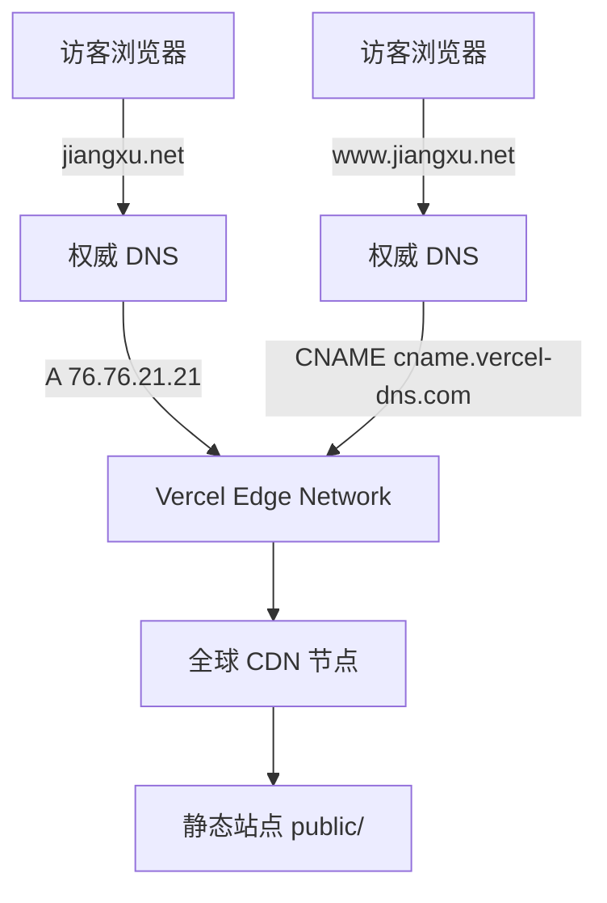

你可能已经把博客搭好了，但每次发文都还要“打包-上传-部署”？今天我们来点优雅的：写完 Markdown，一把 `git push`，网站自动更新，全程无手动。本文用 Hexo + GitHub + Vercel 的经典三件套，手把手带你把自动化这件事变得像呼吸一样自然。整篇文章以已上线的 `jiangxu.net` 为例，顺带聊聊背后的技术原理。

## 我们要得到什么

- 写文章 → `git push` → 几十秒后网站自动发布
- 自定义域名 `jiangxu.net`，含 `www` 子域
- 全站 CDN 加速、原子发布（不会出现“构建到一半页面 404”的尴尬）

## 项目现状（以本仓库为例）

本项目是一个标准 Hexo 项目，核心配置如下：

```yaml
# _config.yml（节选）
url: https://jiangxu.net/
theme: pure
post_asset_folder: true
relative_link: true
syntax_highlighter: highlight.js
```

```json
// package.json（节选）
{
  "hexo": { "version": "7.3.0" },
  "scripts": {
    "start": "hexo server",
    "build": "hexo generate",
    "clean": "hexo clean",
    "deploy": "hexo deploy",
    "clean:deploy": "hexo clean && hexo generate && hexo deploy"
  },
  "dependencies": {
    "hexo": "^7.3.0",
    "hexo-renderer-marked": "^7.0.0",
    "hexo-server": "^3.0.0"
  }
}
```

注意：项目里虽然安装了 `hexo-deployer-git`，但我们将由 Vercel 来托管与发布静态文件，不必再用 `hexo deploy` 推到 GitHub Pages。Vercel 在构建时会执行 `npm ci && npm run build`（或者你自定义的命令），生成 `public/` 目录并发布。

## 架构一图流（你可以先收藏再细看）


## 一步步搭起来

### 1）把 Hexo 项目放到 GitHub

如果你已经有仓库，跳过本节。否则：

```bash
git init
git remote add origin https://github.com/<your-username>/<your-repo>.git
git add .
git commit -m "init blog"
git branch -M main
git push -u origin main
```

### 2）在 Vercel 里“导入”这个仓库

1. 用 GitHub 账号登录 Vercel。
2. New Project → 选中你的仓库 → Import。
3. 配置：
   - Framework Preset：选择 Hexo（或手动）
   - Install Command：默认（推荐 `npm ci`）
   - Build Command：`hexo generate`
   - Output Directory：`public`
4. 点击 Deploy。几十秒后会拿到一个 `*.vercel.app` 的临时域名。

此后每次 push，Vercel 都会自动构建与发布。开分支提 PR 也会生成“预览环境”，方便你把文章和样式改动发给朋友“云审稿”。

### 3）绑定自定义域名 jiangxu.net

在项目 → Settings → Domains 里添加 `jiangxu.net` 与 `www.jiangxu.net`，按提示去域名注册商配置 DNS：

- 根域（apex）：添加 A 记录 → 指向 `76.76.21.21`（Vercel 的 Anycast IP）
- `www` 子域：添加 CNAME → 指向 `cname.vercel-dns.com`

等 DNS 生效后，Vercel 会自动签发 HTTPS 证书（Let’s Encrypt）。如果你想把 `www` 跳转到根域（或反过来），在 Vercel 域名设置里点一下“Redirect”即可。

顺带一提，Hexo 的 `_config.yml` 已把 `url` 设为 `https://jiangxu.net/`：

```yaml
url: https://jiangxu.net/
pretty_urls:
  trailing_index: true
  trailing_html: true
```

这会影响站内链接、RSS、Canonical 等生成，记得与实际域名保持一致。

### 4）写作与发布流程（真正的“自动化”）

日常只做三步：

```bash
hexo new "我的新文章"  # 生成草稿/文章
# 写！配图放到同名资源文件夹（post_asset_folder: true）
git add . && git commit -m "post: 我的新文章" && git push
```

然后泡杯咖啡，等 Vercel 自动完成构建与发布。

## 这些技术原理，知其所以然更香

- Webhooks：Vercel 与 GitHub 通过 Webhooks 通知协作。仓库有新提交 → 触发一次构建。
- CI/CD：Vercel 内置流水线，拉代码 → 安装依赖 → 执行 `hexo generate` → 上传 `public/`。
- 静态化：Hexo 预渲染为纯静态文件（HTML/CSS/JS），天然适合 CDN，延迟低、可承载高并发。
- 原子发布：新版本构建完成后一次性切换，不会出现“部分页面旧、部分页面新”。
- 缓存与失效：CDN 命中为王。新版本发布后 Vercel 会做缓存失效处理，通常无需你手动清缓存。
- 预览环境：每个 PR 一条独立的 Preview URL，不影响生产站点。

## 常用实践与“避坑锦囊”

- 资源管理：`post_asset_folder: true` 已开启。用 `source/_posts/我的新文章/` 管理配图，Markdown 里直接相对路径引用，迁移/重构都不怕。
- 相对链接：`relative_link: true` 可减少跨域/环境差异带来的链接问题。
- 主题与样式：当前主题为 `pure`。如果你改了主题静态资源路径，别忘了清缓存再构建：`npm run clean && npm run build`。
- 不混用两套部署：既然用了 Vercel，就不必再通过 `hexo-deployer-git` 推 GitHub Pages，避免“双主发布”互相覆盖。
- Node 与依赖：为一致的构建结果，建议在 Vercel 的 Project Settings → Environment 里设置 `NODE_VERSION`（如 18/20）并使用 `npm ci`。

## DNS 解析小抄（再来一张图）



## 收尾：写作体验从“还行”升到“上头”

现在，发文这件事就像发朋友圈：写完点发送（push 一下），剩下交给机器。你要做的，不过是保持输出而已。

如果你想继续进阶：

- 在 PR 的 Preview 环境里做 A/B 尝试（比如新主题、新排版）
- 接入评论系统（如 Gitalk/Giscus），在 Vercel 环境变量里配置 Token
- 在构建脚本里加上字数统计、站点地图、SEO 插件

愿你写得开心，站点常新。`jiangxu.net` 我们下次见！


